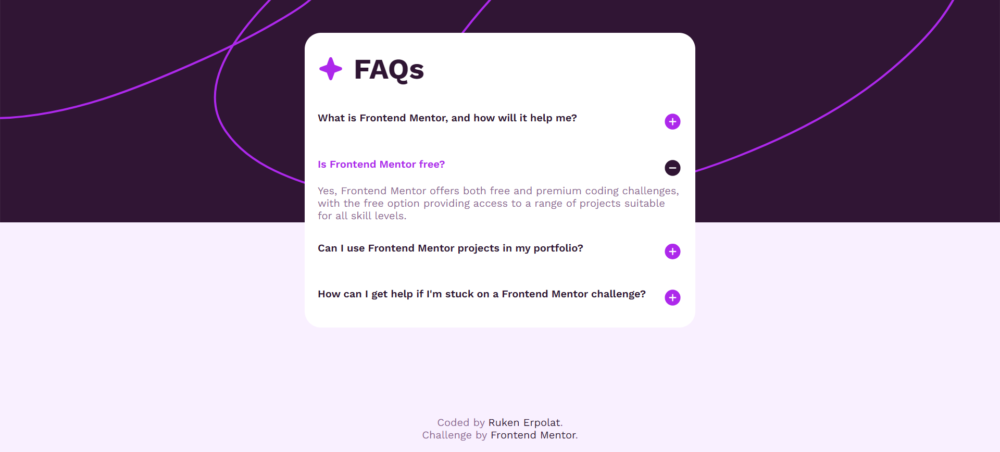
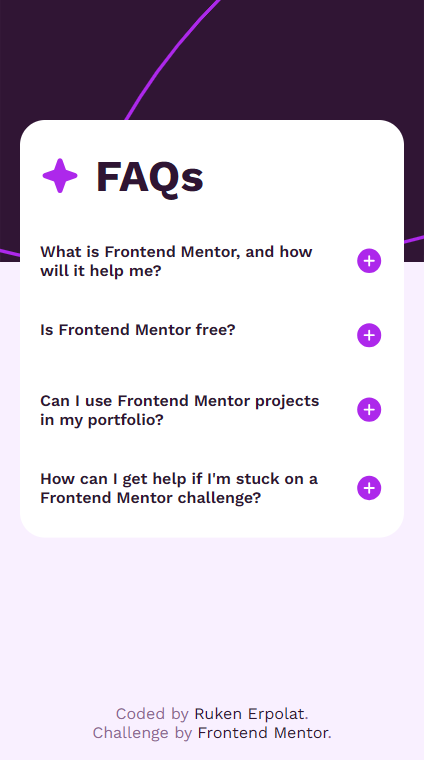
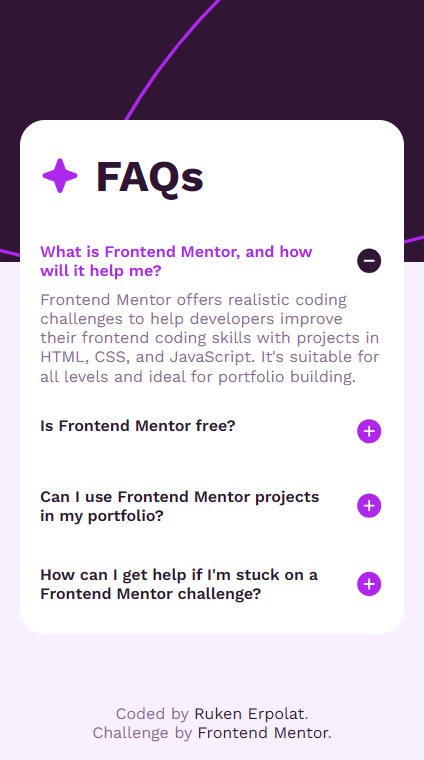

<h1 align="center">Frontend Mentor | FAQ accordion</h1>

<a href="#">[ 🌐 Live Demo ]</a>

This is a solution to the [FAQ accordion challenge on Frontend Mentor](https://www.frontendmentor.io/challenges/faq-accordion-wyfFdeBwBz). Frontend Mentor challenges help you improve your coding skills by building realistic projects.

## Built With

✦ HTML5  
✦ CSS3 | Font : [Work Sans](https://fonts.google.com/specimen/Work+Sans)  
✦ JavaScript (VanilliaJS)

| Desktop                               | Desktop Active                        |
| ------------------------------------- | ------------------------------------- |
|  |  |

| Mobile                        | Mobile Active                        |
| ----------------------------- | ------------------------------------ |
|  |  |

> Thank you for your visit! ♡

<b><em>Ruken ERPOLAT</em></b> 

